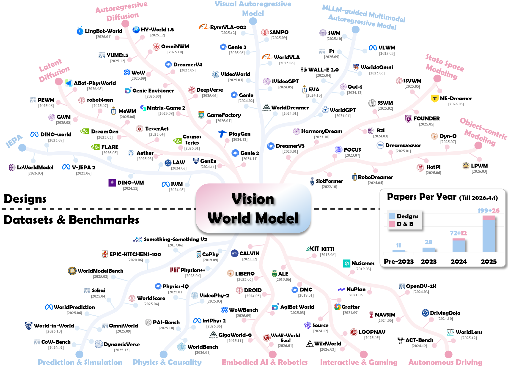
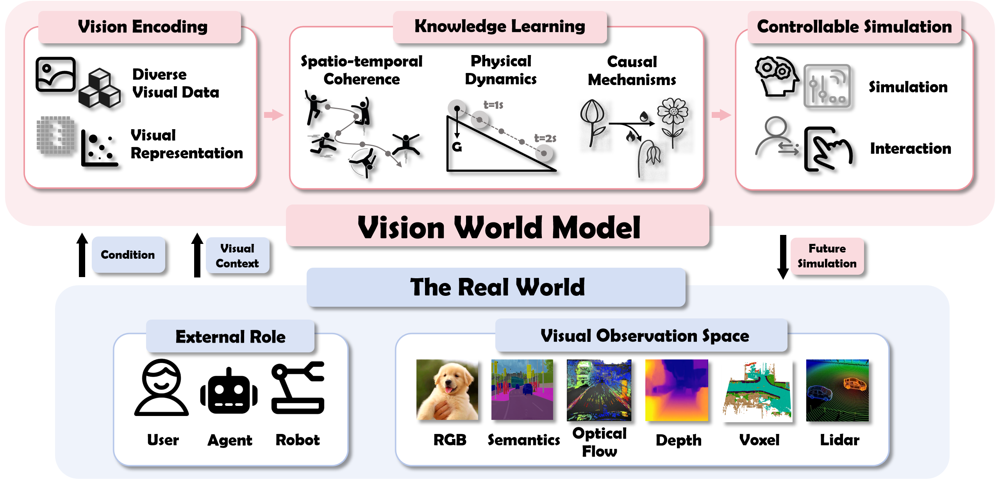
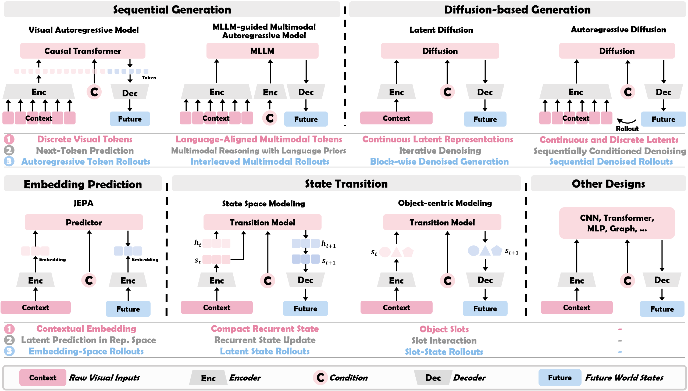
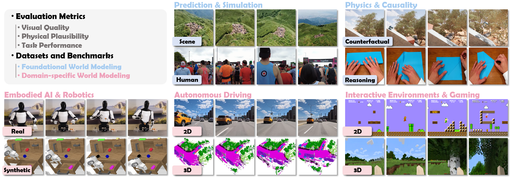

[](https://github.com/sindresorhus/awesome) [](https://www.techrxiv.org) []()

[](https://arxiv.org/abs/25XX.XXXXX) [](https://huggingface.co/papers/)

# :sunglasses: Awesome Vision World Models



## 📖 𝐀 𝐒𝐮𝐫𝐯𝐞𝐲 𝐨𝐧 𝐖𝐨𝐫𝐥𝐝 𝐌𝐨𝐝𝐞𝐥𝐬: 𝐀 𝐕𝐢𝐬𝐢𝐨𝐧 𝐏𝐞𝐫𝐬𝐩𝐞𝐜𝐭𝐢𝐯𝐞

This repository provides a curated list of works on Vision World Models, along with their corresponding **arXiv IDs, GitHub repositories**, and **Project pages**.

For more details, kindly refer to our [paper](./files/temp.pdf) :rocket:


### :books: Citation 

If you find this work helpful for your research, please kindly consider citing our paper:
```bib
WIP
```

### Table of Contents
- [0. Background](#0-background)
- [1. Designs](#1-designs)
  - [1.1. Sequential Generation](#11-sequential-generation)
    - [Autoregressive Transformers](#autoregressive-transformers)
    - [MLLM as Vision World Model Engine](#mllm-as-vision-world-model-engine)
  - [1.2. Diffusion-based Generation](#12-diffusion-based-generation)
    - [Latent Diffusion](#latent-diffusion)
    - [Autoregressive Diffusion](#autoregressive-diffusion)
  - [1.3. Predictive Architecture](#13-predictive-architecture)
    - [JEPA](#jepa)
  - [1.4. State Transition](#14-state-transition)
    - [Latent State-Space Modeling](#latent-state-space-modeling)
    - [Object-Centric Modeling](#object-centric-modeling)
  - [1.5. Other Architectures](#15-other-architectures)
- [2. Datasets \& Benchmarks](#2-datasets--benchmarks)
  - [2.1. General-Purpose World Modeling](#21-general-purpose-world-modeling)
    - [World Prediction and Simulation](#world-prediction-and-simulation)
    - [Physical and Causal Reasoning](#physical-and-causal-reasoning)
  - [2.2. Application-Specific World Modeling](#22-application-specific-world-modeling)
    - [Embodied AI and Robotics](#embodied-ai-and-robotics)
    - [Autonomous Driving](#autonomous-driving)
    - [Interactive Environments and Gaming](#interactive-environments-and-gaming)
- [3. Others](#3-others)
    - [Survey](#survey)
    - [GitHub Repo](#github-repo)
    - [Workshop](#workshop)
    - [Theory](#theory)
    - [World Models for Downstream Tasks](#world-models-for-downstream-tasks)
    - [Other Perspectives of World Modeling](#other-perspectives-of-world-modeling)
- [4. Acknowledgements](#4-acknowledgements)

# 0. Background

## About Vision World Model (VWM)
Definition:

>A vision world model is an AI model that learns to simulate the physical world through visual observation.

Formally, a VWM can be seen as a probabilistic model $f_{\theta}$ that predicts the distribution of future states given observed visual context and interactive conditions:

$$p(\mathcal{R}_{t+1:T}| v_{0:t}, c_{t}) = f_{\theta} (\mathcal{E}(v_{0:t}), c_{t})$$

where $v_{0:t}$ represents the sequence of visual observations from time $0$ to $t$, and $c_{t}$ represents current conditions (e.g., agent actions, language instructions, or control signals). $\mathcal{E}(\cdot)$ denotes the visual encoder that maps raw inputs into tokens or embeddings.
$\mathcal{R}_{t+1:T}$ represents the world representation, which encompasses a broad range of future modalities depending on the paradigm, including future observations ($v_{t+1:T}$), latent states ($s_{t+1:T}$), or other future properties (e.g., segmentation maps, depth, flow, 3D Gaussian splats, or trajectories). 

We further establish a conceptual framework that decomposes VWM into three essential components:

* (1) The Perceptual Foundation: How diverse visual signals are transformed into world representation.

* (2) The Dynamics Core: What "rules of the world" are learned, progressing from spatio-temporal coherence to physical dynamics and causal reasoning.

* (3) The Key Capability: How VWM performs controllable simulation conditioned on actions, language, or other interaction prompts.



## Taxonomy of VWM Designs

We provide an in-depth analysis of VWMs' four major architectural families, applying our three-component framework to compare their underlying mechanisms.



## Evaluation Ecosystem

We provide an extensive review of the evaluation landscape, cataloging metrics and distinguishing between datasets and benchmarks types.




# 1. Designs

## 1.1. Sequential Generation

### Autoregressive Transformers

> :timer_clock: In chronological order, from the latest to the earliest.

| Design  | Paper | Link | 
|:-:|:-|:-:|
||
| `iMoWM` | iMoWM: Taming Interactive Multi-Modal World Model for Robotic Manipulation | [](https://arxiv.org/abs/2510.09036)[](https://xingyoujun.github.io/imowm/) |
| `PWM` | From Forecasting to Planning: Policy World Model for Collaborative State-Action Prediction | [](https://arxiv.org/abs/2510.19654) [](https://github.com/6550Zhao/Policy-World-Model)  |
| `SAMPO` | SAMPO: Scale-wise Autoregression with Motion Prompt for Generative World Models | [](https://arxiv.org/abs/2509.15536) |
| `RynnVLA-001` | RynnVLA-001: Using Human Demonstrations to Improve Robot Manipulation | [](https://arxiv.org/abs/2509.15212) [](https://github.com/alibaba-damo-academy/RynnVLA-001) |
| `OccTENS` | OccTENS: 3D Occupancy World Model via Temporal Next-Scale Prediction | [](https://arxiv.org/abs/2509.03887) |
| `Genie 3` | Genie 3: A new frontier for world models | [](https://deepmind.google/discover/blog/genie-3-a-new-frontier-for-world-models/) |
| `I²-world` | I²-World: Intra-Inter Tokenization for Efficient Dynamic 4D Scene Forecasting | [](https://arxiv.org/abs/2507.09144) [](https://github.com/lzzzzzm/II-World) |
| `UniVLA` | Unified Vision-Language-Action Model | [](https://arxiv.org/abs/2506.19850) [](https://github.com/baaivision/UniVLA) |
| `WorldVLA` | WorldVLA: Towards Autoregressive Action World Model | [](https://arxiv.org/abs/2506.21539) [](https://github.com/alibaba-damo-academy/WorldVLA) |
| `RoboScape` | RoboScape: Physics-informed Embodied World Model | [](https://arxiv.org/abs/2506.23135) [](https://github.com/tsinghua-fib-lab/RoboScape)|
| `Xray2Xray` | Xray2Xray: World Model from Chest X-rays with Volumetric Context | [](https://arxiv.org/abs/2506.19055) |
| `RLVR-World` | RLVR-World: Training World Models with Reinforcement Learning | [](https://arxiv.org/abs/2505.13934) [](https://github.com/thuml/RLVR-World) |
| `MineWorld` | MineWorld: a Real-Time and Open-Source Interactive World Model on Minecraft | [](https://arxiv.org/abs/2504.08388) [](https://github.com/microsoft/mineworld) |
| `UVA` | Unified Video Action Model | [](https://arxiv.org/abs/2503.00200) [](https://github.com/ShuangLI59/unified_video_action) |
| `SurgWM` | Surgical Vision World Model | [](https://arxiv.org/abs/2503.02904) [](https://github.com/bhattarailab/Surgical-Vision-World-Model)|
| `DWS` | Pre-Trained Video Generative Models as World Simulators | [](https://arxiv.org/abs/2502.07825) |
| `VideoWorld` | VideoWorld: Exploring Knowledge Learning from Unlabeled Videos | [](https://arxiv.org/abs/2501.09781) [](https://github.com/ByteDance-Seed/VideoWorld) |
| `Drivingworld` | Drivingworld: Constructing world model for autonomous driving via video GPT | [](https://arxiv.org/abs/2412.19505) [](https://github.com/YvanYin/DrivingWorld) |
| `Moto` | Moto: Latent motion token as the bridging language for learning robot manipulation from video | [](https://arxiv.org/abs/2412.04445) [](https://github.com/TencentARC/Moto) |
| `WHALE` | WHALE: Towards Generalizable and Scalable World Models for Embodied Decision-making | [](https://arxiv.org/abs/2411.05619) |
| `GR-2` | GR-2: A Generative Video-Language-Action Model with Web-Scale Knowledge for Robot Manipulation | [](https://arxiv.org/abs/2410.06158) [](https://gr2-manipulation.github.io/) |
| `LatentDriver` | Learning Multiple Probabilistic Decisions from Latent World Model in Autonomous Driving | [](https://arxiv.org/abs/2409.15730) [](https://github.com/Sephirex-X/LatentDriver) |
| `Renderworld` | Renderworld: World model with self-supervised 3D label | [](https://arxiv.org/abs/2409.11356) |
| `VidIT` | Video In-context Learning: Autoregressive Transformers are Zero-Shot Video Imitators | [](https://arxiv.org/abs/2407.07356) [](https://www.microsoft.com/en-us/research/project/ar-videos/)|
| `iVideoGPT` | iVideoGPT: Interactive VideoGPTs are Scalable World Models | [](https://arxiv.org/abs/2405.15223) [](https://github.com/thuml/iVideoGPT)|
| `Genie` | Genie: Generative Interactive Environments | [](https://arxiv.org/abs/2402.15391) [](https://sites.google.com/view/genie-2024/home)|
| `LWM` | World Model on Million-Length Video And Language With Blockwise RingAttention | [](https://arxiv.org/abs/2402.08268) [](https://github.com/LargeWorldModel/LWM)|
| `WHAM` | World and human action models towards gameplay ideation | [](https://www.nature.com/articles/s41586-025-08600-3)|
| `WorldDreamer` | WorldDreamer: Towards General World Models for Video Generation via Predicting Masked Tokens | [](https://arxiv.org/abs/2401.09985) [](https://github.com/JeffWang987/WorldDreamer) |
| `OccWorld` | OccWorld: Learning a 3D Occupancy World Model for Autonomous Driving | [](https://arxiv.org/abs/2311.16038) [](https://github.com/wzzheng/OccWorld)|
| `GAIA-1` | Gaia-1: A generative world model for autonomous driving | [](https://arxiv.org/abs/2309.17080) [](https://wayve.ai/science/gaia/)|

### MLLM as Vision World Model Engine

> :timer_clock: In chronological order, from the latest to the earliest.

| Design  | Paper | Link | 
|:-:|:-|:-:|
||
| `AstraNav-World` | AstraNav-World: World Model for Foresight Control and Consistency | [](https://arxiv.org/abs/2512.21714)  [](https://astra-amap.github.io/AstraNav-World.github.io/) [](https://github.com/amap-cvlab/AstraNav-World)|
| `RynnVLA-002` | RynnVLA-002: A Unified Vision-Language-Action and World Model | [](https://arxiv.org/abs/2511.17502)  [](https://github.com/alibaba-damo-academy/RynnVLA-002)|
| `SWM` | Semantic World Models | [](https://arxiv.org/abs/2510.19818)  [](https://weirdlabuw.github.io/swm/)|
| `UniWM` | Unified World Models: Memory-Augmented Planning and Foresight for Visual Navigation | [](https://arxiv.org/abs/2510.08713)   [](https://github.com/F1y1113/UniWM) |
| `F1` | F1: A Vision-Language-Action Model Bridging Understanding and Generation to Actions | [](https://arxiv.org/abs/2509.06951) [](https://github.com/InternRobotics/F1-VLA) |
| `OccVLA` | OccVLA: Vision-Language-Action Model with Implicit 3D Occupancy Supervision | [](https://arxiv.org/abs/2509.05578) |
| `VLWM` | Planning with Reasoning using Vision Language World Model | [](https://arxiv.org/abs/2509.02722)  |
| `DreamVLA` | DreamVLA: A Vision-Language-Action Model Dreamed with Comprehensive World Knowledge | [](https://arxiv.org/abs/2507.04447) [](https://github.com/Zhangwenyao1/DreamVLA) |
| `World4Omni` | World4Omni: A Zero-Shot Framework from Image Generation World Model to Robotic Manipulation | [](https://arxiv.org/abs/2506.23919)[](https://nus-lins-lab.github.io/goalvlaweb/) |
| `WALL-E 2.0` | WALL-E 2.0: World Alignment by NeuroSymbolic Learning Improves World Model-based LLM Agent | [](https://arxiv.org/abs/2504.15785)[](https://github.com/elated-sawyer/WALL-E) |
| `GR00T N1` | GR00T N1: An Open Foundation Model for Generalist Humanoid Robots | [](https://arxiv.org/abs/2503.14734) [](https://github.com/NVIDIA/Isaac-GR00T)|
| `HERMES` | HERMES: A Unified Self-Driving World Model for Simultaneous 3D Scene Understanding and Generation | [](https://arxiv.org/abs/2501.14729) [](https://github.com/LMD0311/HERMES) |
| `Doe-1` | Doe-1: Closed-Loop Autonomous Driving with Large World Model | [](https://arxiv.org/abs/2412.09627)[](https://github.com/wzzheng/Doe) |
| `Owl-1` | Owl-1: Omni World Model for Consistent Long Video Generation | [](https://arxiv.org/abs/2412.09600) [](https://github.com/huang-yh/Owl)|
| `Eva` | Eva: An Embodied World Model for Future Video Anticipation | [](https://arxiv.org/abs/2410.15461) [](https://sites.google.com/view/icml-eva)|
| `PIVOT-R` | PIVOT-R: Primitive-Driven Waypoint-Aware World Model for Robotic Manipulation | [](https://arxiv.org/abs/2410.10394) [](https://github.com/abliao/PIVOT-R)|
| `OccLLaMA` | OccLLaMA: An Occupancy-Language-Action Generative World Model for Autonomous Driving | [](https://arxiv.org/abs/2409.03272) [](https://vilonge.github.io/OccLLaMA_Page/)|
| `WorldGPT` | WorldGPT: Empowering LLM as Multimodal World Model | [](https://arxiv.org/abs/2404.18202) [](https://github.com/DCDmllm/WorldGPT)|
| `3D-VLA` | 3D-VLA: A 3D Vision-Language-Action Generative World Model | [](https://arxiv.org/abs/2403.09631)[](https://vis-www.cs.umass.edu/3dvla)|
| `ADriver-I` | ADriver-I: A General World Model for Autonomous Driving | [](https://arxiv.org/abs/2311.13549) |
||

## 1.2. Diffusion-based Generation

### Latent Diffusion

> :timer_clock: In chronological order, from the latest to the earliest.

| Design  | Paper | Link | 
|:-:|:-|:-:|
||
| `GrndCtrl`  | GrndCtrl: Grounding World Models via Self-Supervised Reward Alignment |  [](https://arxiv.org/abs/2512.01952) [](https://rlwg-grndctrl.github.io/) |
| `C^3`  | World Models That Know When They Don’t Know: Controllable Video Generation with Calibrated Uncertainty |  [](https://arxiv.org/abs/2512.05927) [](https://github.com/irom-princeton/c-cubed) [](https://c-cubed-uq.github.io/)|
| `GAIA-3`  | GAIA-3: Scaling World Models to Power Safety and Evaluation |  [](https://wayve.ai/thinking/gaia-3/) |
| `WristWorld`  | WristWorld: Generating Wrist-Views via 4D World Models for Robotic Manipulation |  [](https://arxiv.org/abs/2510.07313) [](https://github.com/XuWuLingYu/WristWorld) |
| `WorldSplat`  | WorldSplat: Gaussian-Centric Feed-Forward 4D Scene Generation for Autonomous Driving |  [](https://arxiv.org/abs/2509.23402) [](https://github.com/wm-research/worldsplat) |
| `WorldForge`  | WorldForge: Unlocking Emergent 3D/4D Generation in Video Diffusion Model via Training-Free Guidance |  [](https://arxiv.org/abs/2509.15130) [](https://github.com/Westlake-AGI-Lab/WorldForge) |
| `PEWM`  | Learning Primitive Embodied World Models: Towards Scalable Robotic Learning |  [](https://arxiv.org/abs/2508.20840) [](https://github.com/qiaosun22/PrimitiveWorld) |
| `Video Policy`  | Video Generators are Robot Policies |  [](https://arxiv.org/abs/2508.00795) [](https://github.com/cvlab-columbia/videopolicy) |
| `Ego-PM`  | Ego-centric Predictive Model Conditioned on Hand Trajectories |  [](https://arxiv.org/abs/2508.19852) [](https://github.com/binjiezhang/Ego-PM) |
| `GWM`  | GWM: Towards Scalable Gaussian World Models for Robotic Manipulation |  [](https://arxiv.org/abs/2508.17600) [](https://github.com/Gaussian-World-Model/gaussianwm) |
| `M3arsSynth`  | Martian World Models: Controllable Video Synthesis with Physically Accurate 3D Reconstructions |  [](https://arxiv.org/abs/2507.07978) [](https://github.com/loongfeili/Martian-World-Model) |
| `AirScape`  | AirScape: An Aerial Generative World Model with Motion Controllability |  [](https://arxiv.org/abs/2507.08885) [](https://github.com/EmbodiedCity/AirScape.code) |
| `robot4dgen`  | Geometry-aware 4D Video Generation for Robot Manipulation |  [](https://arxiv.org/abs/2507.01099) [](https://github.com/lzylucy/4dgen) |
| `Genesis`  | Genesis: Multimodal Driving Scene Generation with Spatio-Temporal and Cross-Modal Consistency |  [](https://arxiv.org/abs/2506.07497) [](https://github.com/xiaomi-research/genesis) |
| `MinD`  | MinD: Learning A Dual-System World Model for Real-Time Planning and Implicit Risk Analysis |  [](https://arxiv.org/abs/2506.18897) [](https://github.com/manipulate-in-dream/MinD) |
| `RealPlay`  | PreFM: Online Audio-Visual Event Parsing via Predictive Future Modeling |  [](https://arxiv.org/abs/2506.18901) [](https://github.com/wenqsun/Real-Play) |
| `COME`  | COME: Adding Scene-Centric Forecasting Control to Occupancy World Model |  [](https://arxiv.org/abs/2506.13260) [](https://github.com/synsin0/COME) |
| `MeWM`  | Medical World Model:  Generative Simulation of Tumor Evolution for Treatment Planning |  [](https://arxiv.org/abs/2506.02327) [](https://github.com/scott-yjyang/MeWM) |
| `StateSpaceDiffuser`  | StateSpaceDiffuser: Bringing Long Context to Diffusion World Models |  [](https://arxiv.org/abs/2505.22246) [](https://github.com/insait-institute/StateSpaceDiffuser)|
| `GeoDrive`  | GeoDrive: 3D Geometry-Informed Driving World Model with Precise Action Control |  [](https://arxiv.org/abs/2505.22421) [](https://github.com/antonioo-c/GeoDrive) |
| `3DPEWM`  | Learning 3d persistent embodied world models |  [](https://arxiv.org/abs/2505.05495)|
| `RoboTransfer`  | RoboTransfer: Geometry-Consistent Video Diffusion for Robotic Visual Policy Transfer |  [](https://arxiv.org/abs/2505.23171) [](https://github.com/HorizonRobotics/RoboTransfer) |
| `FlowDreamer`  | FlowDreamer: A RGB-D World Model with Flow-based Motion Representations  for Robot Manipulation |  [](https://arxiv.org/abs/2505.10075) [](https://github.com/sharinka0715/FlowDreamer) |
| `LaDi-WM`  | LaDi-WM: A Latent Diffusion-based World Model for Predictive Manipulation |  [](https://arxiv.org/abs/2505.11528) [](https://github.com/GuHuangAI/LaDiWM) |
| `LangToMo`  | Pixel motion as universal representation for robot control |  [](https://arxiv.org/abs/2505.07817) [](https://github.com/kahnchana/LangToMo) |
| `DreamGen`  | DreamGen: Unlocking Generalization in Robot Learning through Video World Models |  [](https://arxiv.org/abs/2505.12705) [](https://github.com/nvidia/GR00T-dreams) |
| ` Learning to Drive`  |  Learning to Drive from a World Model |  [](https://arxiv.org/abs/2504.19077) [](https://blog.comma.ai/mlsim)|
| `Tesseract`  | Tesseract: Learning 4d embodied world models |  [](https://arxiv.org/abs/2504.20995) [](https://github.com/UMass-Embodied-AGI/TesserAct) |
| `UWM`  | Unified world models: Coupling video and action diffusion for pretraining on large robotic datasets |  [](https://arxiv.org/abs/2504.02792) [](https://github.com/WEIRDLabUW/unified-world-model) |
| `ViMo`  | ViMo: A Generative Visual GUI World Model for App Agents|  [](https://arxiv.org/abs/2504.13936) [](https://github.com/ai-agents-2030/ViMo) |
| `DiST-4D`  | DiST-4D: Disentangled Spatiotemporal Diffusion with Metric Depth  for 4D Driving Scene Generation |  [](https://arxiv.org/abs/2503.15208) [](https://github.com/royalmelon0505/dist4d) |
| `Aether`  | Aether: Geometric-aware unified world modeling |  [](https://arxiv.org/abs/2503.18945) [](https://github.com/InternRobotics/Aether) |
| `Cosmos transfer1`  | Cosmos transfer1: Conditional world generation with adaptive multimodal control |  [](https://arxiv.org/abs/2503.14492) [](https://github.com/nvidia-cosmos/cosmos-transfer1) |
| `GAIA-2`  | GAIA-2: A Controllable Multi-View Generative World Model for Autonomous Driving |  [](https://arxiv.org/abs/2503.20523) [](https://wayve.ai/thinking/gaia-2/) |
| `EDELINE`  | EDELINE: Enhancing Memory in Diffusion-based World Models via Linear-Time Sequence Modeling |  [](https://arxiv.org/abs/2502.00466) [](https://github.com/LJH-coding/EDELINE) |
| `MaskGWM`  | MaskGWM: A Generalizable Driving World Model with Video Mask Reconstruction |  [](https://arxiv.org/abs/2502.11663) [](https://github.com/SenseTime-FVG/OpenDWM) |
| `Dreamdrive`  | Dreamdrive: Generative 4d scene modeling from street view images |  [](https://arxiv.org/abs/2501.00601) [](https://github.com/NVlabs/DreamDrive) |
| `Cosmos`  | Cosmos World Foundation Model Platform for Physical AI |  [](https://arxiv.org/abs/2501.03575) [](https://github.com/nvidia-cosmos) |
| `VPP`  | Video prediction policy: A generalist robot policy with predictive visual representations |  [](https://arxiv.org/abs/2412.14803) [](https://github.com/roboterax/video-prediction-policy) |
| `Imagine-2-drive`  | Imagine-2-drive: High-fidelity world modeling in carla for autonomous vehicles |  [](https://arxiv.org/abs/2411.10171) [](https://github.com/anantagrg/Imagine-2-Drive) |
| `GenEx`  | Generative World Explorer |  [](https://arxiv.org/abs/2411.11844) [](https://github.com/GenEx-world/genex) |
| `DOME`  | DOME: Taming Diffusion Model into High-Fidelity Controllable Occupancy World Model |  [](https://arxiv.org/abs/2410.10429) [](https://github.com/gusongen/DOME) |
| `Panacea+`  | Panacea+: Panoramic and Controllable Video Generation for Autonomous Driving |  [](https://arxiv.org/abs/2408.07605) [](https://github.com/wenyuqing/panacea) |
| `Bevworld`  | Bevworld: A multimodal world model for autonomous driving via unified bev latent space |  [](https://arxiv.org/abs/2407.05679) [](https://github.com/zympsyche/BevWorld) |
| `Delphi`  | Unleashing generalization of end-to-end autonomous driving with controllable long video generation |  [](https://arxiv.org/abs/2406.01349) [](https://github.com/westlake-autolab/Delphi) |
| `Occsora`  | Occsora: 4d occupancy generation models as world simulators for autonomous driving |  [](https://arxiv.org/abs/2405.20337) [](https://github.com/wzzheng/OccSora) |
| `GenAD`  | Generalized Predictive Model for Autonomous Driving |  [](https://arxiv.org/abs/2403.09630) [](https://github.com/OpenDriveLab/DriveAGI) |
| `WorldGPT`  | Worldgpt: a sora-inspired video ai agent as rich world models from text and image inputs |  [](https://arxiv.org/abs/2403.07944)|
| `DriveDreamer-2`  | DriveDreamer-2: LLM-Enhanced World Models for Diverse Driving Video Generation |  [](https://arxiv.org/abs/2403.06845) [](https://github.com/f1yfisher/DriveDreamer2) |
| `WoVoGen`  | WoVoGen: World Volume-Aware Diffusion for Controllable Multi-Camera Driving Scene Generation |  [](https://arxiv.org/abs/2312.02934) [](https://github.com/fudan-zvg/WoVoGen) |
| `Drive-WM`  | Driving into the Future: Multiview Visual Forecasting and Planning with World Model for Autonomous Driving |  [](https://arxiv.org/abs/2311.17918) [](https://github.com/BraveGroup/Drive-WM) |
| `Panacea`  | Panacea: Panoramic and controllable video generation for autonomous driving |  [](https://arxiv.org/abs/2311.16813) [](https://github.com/wenyuqing/panacea) |
| `Drivingdiffusion`  | DrivingDiffusion: Layout-Guided multi-view driving scene video generation with latent diffusion model |  [](https://arxiv.org/abs/2310.07771) [](https://github.com/shalfun/DrivingDiffusion) |
| `DriveDreamer`  | DriveDreamer: Towards Real-world-driven World Models for Autonomous Driving |  [](https://arxiv.org/abs/2309.09777) [](https://github.com/JeffWang987/DriveDreamer) |
| `UniPi`  | Learning universal policies via text-guided video generation |  [](https://arxiv.org/abs/2302.00111) [](https://universal-policy.github.io/unipi/) |
||


### Autoregressive Diffusion

> :timer_clock: In chronological order, from the latest to the earliest.

| Design  | Paper | Link | 
|:-:|:-|:-:|
||
| `Yume1.5`  | Yume1.5: A Text-Controlled Interactive World Generation Model |  [](https://arxiv.org/abs/2512.22096) [](https://github.com/stdstu12/YUME) [](https://stdstu12.github.io/YUME-Project/)|
| `HY-World 1.5`  | HY-World 1.5: A Systematic Framework for Interactive World Modeling with Real-Time Latency and Geometric Consistency |  [](https://github.com/Tencent-Hunyuan/HY-WorldPlay)|
| `Astra`  | Astra: General Interactive World Model with Autoregressive Denoising |  [](https://arxiv.org/abs/2512.08931) [](https://github.com/EternalEvan/Astra) [](https://eternalevan.github.io/Astra-project/)|
| `RELIC`  | RELIC: Interactive Video World Model with Long-Horizon Memory |  [](https://arxiv.org/abs/2512.04040) [](https://relic-worldmodel.github.io/)|
| `ANWM`  | Aerial World Model for Long-horizon Visual Generation and Navigation in 3D Space |  [](https://arxiv.org/abs/2512.21887)|
| `WorldPack`  | WorldPack: Compressed Memory Improves Spatial Consistency in Video World Modeling |  [](https://arxiv.org/abs/2512.02473)|
| `Hunyuan-GameCraft-2`  | Hunyuan-GameCraft-2: Instruction-following Interactive Game World Model |  [](https://arxiv.org/abs/2511.23429) [](https://hunyuan-gamecraft-2.github.io/)|
| `PAN` | PAN: A World Model for General, Interactable, and Long-Horizon World Simulation | [](https://arxiv.org/abs/2511.09057) [](https://ifm.mbzuai.ac.ae/pan/) |
| `Emu3.5` | Emu3.5: Native Multimodal Models are World Learners | [](https://arxiv.org/abs/2510.26583) [](https://github.com/baaivision/Emu3.5) |
| `OmniNWM`  | OmniNWM: Omniscient Driving Navigation World Models |  [](https://arxiv.org/abs/2510.18313) [](https://github.com/Ma-Zhuang/OmniNWM) |
| `WoW`  | WoW: Towards a World omniscient World model Through Embodied Interaction |  [](https://arxiv.org/abs/2509.22642) [](https://github.com/wow-world-model/wow-world-model) |
| `LongScape`  | PreFM: Online Audio-Visual Event Parsing via Predictive Future Modeling |  [](https://arxiv.org/abs/2509.21790) [](https://github.com/tsinghua-fib-lab/Longscape) |
| `Dreamer V4`  | Training Agents Inside of Scalable World Models |  [](https://arxiv.org/abs/2509.24527) [](https://danijar.com/project/dreamer4/) |
| `Genie Envisioner`  | Genie Envisioner: A Unified World Foundation Platform for Robotic Manipulation |  [](https://arxiv.org/abs/2508.05635) [](https://github.com/AgibotTech/Genie-Envisioner) |
| `LiDARCrafter`  | LiDARCrafter: Dynamic 4D World Modeling from LiDAR Sequences |  [](https://arxiv.org/abs/2508.03692) [](https://github.com/worldbench/lidarcrafter) |
| `Yan`  | Yan: Foundational Interactive Video Generation |  [](https://arxiv.org/abs/2508.08601) [](https://greatx3.github.io/Yan/)|
| `Matrix-Game 2.0`  | Matrix-Game 2.0: An Open-Source, Real-Time, and Streaming Interactive World Model |  [](https://arxiv.org/abs/2508.13009) [](https://github.com/SkyworkAI/Matrix-Game/tree/main/Matrix-Game-2) |
| `Yume`  | Yume: An Interactive World Generation Model |  [](https://arxiv.org/abs/2507.17744) [](https://github.com/stdstu12/YUME) |
| `Geometry Forcing`  | Geometry Forcing: Marrying Video Diffusion and 3D Representation for Consistent World Modeling |  [](https://arxiv.org/abs/2507.07982) [](https://github.com/CIntellifusion/GeometryForcing) |
| `spmem`  | Video World Models with Long-term Spatial Memory |  [](https://arxiv.org/abs/2506.05284) [](https://spmem.github.io/)|
| `STAGE`  | STAGE: A Stream-Centric Generative World Model for Long-Horizon Driving-Scene Simulation |  [](https://arxiv.org/abs/2506.13138) [](https://4dvlab.github.io/STAGE/) |
| `CaM`  | Context as Memory: Scene-Consistent Interactive Long Video Generation with Memory Retrieval |  [](https://arxiv.org/abs/2506.03141) [](https://context-as-memory.github.io/) |
| `DeepVerse`  | DeepVerse: 4D Autoregressive Video Generation as a World Model |  [](https://arxiv.org/abs/2506.01103) [](https://github.com/SOTAMak1r/DeepVerse) |
| `Epona`  | Epona: Autoregressive Diffusion World Model for Autonomous Driving |  [](https://arxiv.org/abs/2506.24113) [](https://github.com/Kevin-thu/Epona) |
| `SceneDiffuser++`  | SceneDiffuser++: City-Scale Traffic Simulation via a Generative World Model |  [](https://arxiv.org/abs/2506.21976) |
| `VMem`  | VMem: Consistent Interactive Video Scene Generation with Surfel-Indexed View Memory |  [](https://arxiv.org/abs/2506.18903) [](https://github.com/runjiali-rl/vmem) |
| `Hunyuan-GameCraft`  | Hunyuan-GameCraft: High-dynamic Interactive Game Video Generation with Hybrid History Condition |  [](https://arxiv.org/abs/2506.17201) [](https://github.com/Tencent-Hunyuan/Hunyuan-GameCraft-1.0) |
| `Matrix-Game`  | Matrix-Game: Interactive World Foundation Model |  [](https://arxiv.org/abs/2506.18701) [](https://github.com/SkyworkAI/Matrix-Game/tree/main/Matrix-Game-1) |
| `PEVA`  | Whole-Body Conditioned Egocentric Video Prediction |  [](https://arxiv.org/abs/2506.21552)[](https://dannytran123.github.io/PEVA/)  |
| `NFD`  | Playing with Transformer at 30+ FPS via Next-Frame Diffusion |  [](https://arxiv.org/abs/2506.01380)[](https://nextframed.github.io/)  |
| `VRAG`  | Learning World Models for Interactive Video Generation |  [](https://arxiv.org/abs/2505.21996) [](https://sites.google.com/view/vrag)|
| `DriVerse`  | DriVerse: Navigation World Model for Driving Simulation via Multimodal Trajectory Prompting and Motion Alignment |  [](https://arxiv.org/abs/2504.18576) [](https://github.com/shalfun/DriVerse) |
| `WORLDMEM`  | WORLDMEM: Long-term Consistent World Simulation with Memory |  [](https://arxiv.org/abs/2504.12369) [](https://github.com/xizaoqu/WorldMem) |
| `Adaworld`  | Adaworld: Learning adaptable world models with latent actions |  [](https://arxiv.org/abs/2503.18938) [](https://github.com/Little-Podi/AdaWorld) |
| `TSWM`  | Toward Stable World Models: Measuring and Addressing World Instability in Generative Environments |  [](https://arxiv.org/abs/2503.08122)|
| `Gamefactory`  | Gamefactory: Creating new games with generative interactive videos |  [](https://arxiv.org/abs/2501.08325) [](https://github.com/KwaiVGI/GameFactory) |
| `PlayGen`  | Playable Game Generation |  [](https://arxiv.org/abs/2412.00887) [](https://github.com/GreatX3/Playable-Game-Generation) |
| `InfinityDrive`  | InfinityDrive: Breaking Time Limits in Driving World Models |  [](https://arxiv.org/abs/2412.01522) [](https://metadrivescape.github.io/papers_project/InfinityDrive/page.html) |
| `GEM`  | Gem: A generalizable ego-vision multimodal world model for fine-grained ego-motion, object dynamics, and scene composition control |  [](https://arxiv.org/abs/2412.11198) [](https://github.com/vita-epfl/GEM) |
| `UniMLVG`  | UniMLVG: Unified Framework for Multi-view Long Video Generation with Comprehensive Control Capabilities for Autonomous Driving |  [](https://arxiv.org/abs/2412.04842) [](https://github.com/SenseTime-FVG/OpenDWM) |
| `The Matrix`  | The Matrix: Infinite-Horizon World Generation with Real-Time Moving Control |  [](https://arxiv.org/abs/2412.03568)[](https://thematrix1999.github.io/index.html) |
| `NWM`  | Navigation World Models |  [](https://arxiv.org/abs/2412.03572) [](https://github.com/facebookresearch/nwm) |
| `Copilot4D`  | Copilot4D: Learning Unsupervised World Models for Autonomous Driving via Discrete Diffusion |  [](https://arxiv.org/abs/2311.01017) [](https://waabi.ai/research/copilot-4d) |
| `Drivingsphere`  | Drivingsphere: Building a high-fidelity 4d world for closed-loop simulation |  [](https://arxiv.org/abs/2411.11252) [](https://github.com/yanty123/DrivingSphere) |
| `Gamegen-x`  | Gamegen-x: Interactive open-world game video generation |  [](https://arxiv.org/abs/2411.00769) [](https://github.com/GameGen-X/GameGen-X) |
| `Genie 2`  | Genie 2: A large-scale foundation world model |  [](https://deepmind.google/discover/blog/genie-2-a-large-scale-foundation-world-model/)|
| `oasis`  | Oasis: A Universe in a Transformer | [](https://github.com/etched-ai/open-oasis) [](https://oasis-model.github.io/)|
| `GameNGen`  | Diffusion models are real-time game engines |  [](https://arxiv.org/abs/2408.14837)[](https://gamengen.github.io/)|
| `IRAsim`  | IRASim: A Fine-Grained World Model for Robot Manipulation |  [](https://arxiv.org/abs/2406.14540) [](https://github.com/bytedance/IRASim) |
| `diamond`  | Diffusion for World Modeling: Visual Details Matter in Atari |  [](https://arxiv.org/abs/2405.12399) [](https://github.com/eloialonso/diamond) |
| `Vista`  | Vista: A generalizable driving world model with high fidelity and versatile controllability |  [](https://arxiv.org/abs/2405.17398) [](https://github.com/OpenDriveLab/Vista) |
| `UniSim`  | UniSim: Learning Interactive Real-World Simulators |  [](https://arxiv.org/abs/2310.06114)[](https://universal-simulator.github.io/unisim//)  |
||


## 1.3. Predictive Architecture

### JEPA

> :timer_clock: In chronological order, from the latest to the earliest.

| Design  | Paper | Link | 
|:-:|:-|:-:|
| `DINO-world`  | Back to the Features: DINO as a Foundation for Video World Models |  [](https://arxiv.org/abs/2507.19468) |
| `V-JEPA 2`  | V-JEPA 2: Self-Supervised Video Models Enable Understanding, Prediction and Planning |  [](https://arxiv.org/abs/2506.09985) [](https://github.com/facebookresearch/vjepa2) |
| `SIVWM`  | Sparse Imagination for Efficient Visual World Model Planning |  [](https://arxiv.org/abs/2506.01392) |
| `seq-JEPA`  | seq-JEPA: Autoregressive Predictive Learning of Invariant-Equivariant World Models |  [](https://arxiv.org/abs/2505.03176) [](https://github.com/hafezgh/seq-jepa) |
| `Flare`  | Flare: Robot learning with implicit world modeling |  [](https://arxiv.org/abs/2505.15659) [](https://github.com/JiahengHu/FLaRe) |
| `OSVI-WM`  | OSVI-WM: One-Shot Visual Imitation for Unseen Tasks using World-Model-Guided Trajectory Generation |  [](https://arxiv.org/abs/2505.20425) [](https://github.com/raktimgg/osvi-wm) |
| `EchoWorld`  | EchoWorld: Learning Motion-Aware World Models for Echocardiography Probe Guidance |  [](https://arxiv.org/abs/2504.13065) [](https://github.com/LeapLabTHU/EchoWorld) |
| `AD-L-JEPA`  | AD-L-JEPA: Self-Supervised Spatial World Models with Joint Embedding Predictive Architecture for Autonomous Driving with LiDAR Data |  [](https://arxiv.org/abs/2501.04969) [](https://github.com/HaoranZhuExplorer/AD-L-JEPA-Release) |
| `DINO-Foresight`  | DINO-Foresight: Looking into the Future with DINO |  [](https://arxiv.org/abs/2412.11673) [](https://github.com/Sta8is/DINO-Foresight) |
| `DINO-WM`  | DINO-WM: World Models on Pre-trained Visual Features enable Zero-shot Planning |  [](https://arxiv.org/abs/2411.04983) [](https://github.com/gaoyuezhou/dino_wm) |
| `LAW`  | Enhancing End-to-End Autonomous Driving with Latent World Model |  [](https://arxiv.org/abs/2406.08481) [](https://github.com/BraveGroup/LAW) |
| `V-JEPA`  | Revisiting Feature Prediction for Learning Visual Representations from Video |  [](https://arxiv.org/abs/2404.08471) [](https://github.com/facebookresearch/jepa) |
| `IWM`  | Learning and Leveraging World Models in Visual Representation Learning |  [](https://arxiv.org/abs/2403.00504) |
||

## 1.4. State Transition

### Latent State-Space Modeling

> :timer_clock: In chronological order, from the latest to the earliest.

| Design  | Paper | Link | 
|:-:|:-|:-:|
||
| `BOOM`  | Bootstrap Off-policy with World Model |  [](https://arxiv.org/abs/2511.00423) [](https://github.com/molumitu/BOOM_MBRL)|
| `GASv2`  | Visuomotor Grasping with World Models for Surgical Robots |  [](https://arxiv.org/abs/2508.11200) |
| `LPS`  | Latent Policy Steering with Embodiment-Agnostic Pretrained World Models |  [](https://arxiv.org/abs/2507.13340) |
| `EMERALD`  | Accurate and Efficient World Modeling with Masked Latent Transformers |  [](https://arxiv.org/abs/2507.04075) [](https://github.com/burchim/EMERALD) |
| `FOUNDER`  | FOUNDER: Grounding Foundation Models in World Models for Open-Ended Embodied Decision Making |  [](https://arxiv.org/abs/2507.12496) [](https://sites.google.com/view/founder-rl)|
| `NavMorph`  | NavMorph: A Self-Evolving World Model for Vision-and-Language Navigation in Continuous Environments |  [](https://arxiv.org/abs/2506.23468) [](https://github.com/Feliciaxyao/NavMorph) |
| `Raw2Drive`  | Raw2Drive: Reinforcement Learning with Aligned World Models for End-to-End Autonomous Driving |  [](https://arxiv.org/abs/2505.16394)  |
| `SSVWM`  | Long-Context State-Space Video World Models |  [](https://arxiv.org/abs/2505.20171) [](https://ryanpo.com/ssm_wm/)|
| `PIN-WM`  | PIN-WM: Learning Physics-Informed World Models for Non-Prehensile Manipulation |  [](https://arxiv.org/abs/2504.16693) [](https://github.com/XuAdventurer/PIN-WM)|
| `ReDRAW`  | Adapting World Models with Latent-State Dynamics Residuals |  [](https://arxiv.org/abs/2504.02252) [](https://redraw.jblanier.net/)|
| `WoTE`  | End-to-End Driving with Online Trajectory Evaluation via BEV World Model |  [](https://arxiv.org/abs/2504.01941) [](https://github.com/liyingyanUCAS/WoTE) |
| `DyWA`  | DyWA: Dynamics-Adaptive World Action Model for Generalizable Non-Prehensile Manipulation |  [](https://arxiv.org/abs/2503.16806) [](https://github.com/jiangranlv/DyWA)|
| `DMWM`  | DMWM: Dual-Mind World Model with Long-Term Imagination |  [](https://arxiv.org/abs/2502.07591) [](https://github.com/news-vt/DMWM) |
| `Simulus`  | Uncovering Untapped Potential in Sample-Efficient World Model Agents |  [](https://arxiv.org/abs/2502.11537) [](https://github.com/leor-c/Simulus) |
| `S5WM`  | Accelerating Model-Based Reinforcement Learning with State-Space World Models |  [](https://arxiv.org/abs/2502.20168) |
| `AdaWM`  | AdaWM: Adaptive World Model based Planning for Autonomous Driving |  [](https://arxiv.org/abs/2501.13072) |
| `RoboHorizon`  | RoboHorizon: An LLM-Assisted Multi-View World Model for Long-Horizon Robotic Manipulation |  [](https://arxiv.org/abs/2501.06605) |
| `LS-Imagine`  | Open-World Reinforcement Learning over Long Short-Term Imagination |  [](https://arxiv.org/abs/2410.03618) [](https://github.com/qiwang067/LS-Imagine) |
| `-`  | Mitigating Covariate Shift in Imitation Learning for Autonomous Vehicles Using Latent Space Generative World Models |  [](https://arxiv.org/abs/2409.16663) |
| `GenRL`  | GenRL: Multimodal-Foundation World Models for Generalization in Embodied Agents |  [](https://arxiv.org/abs/2406.18043) [](https://github.com/mazpie/genrl)|
| `DriveWorld`  | DriveWorld: 4D Pre-Trained Scene Understanding via World Models for Autonomous Driving |  [](https://arxiv.org/abs/2405.04390) |
| `Puppeteer`  | Hierarchical World Models as Visual Whole-Body Humanoid Controllers |  [](https://arxiv.org/abs/2405.18418) [](https://github.com/nicklashansen/puppeteer)|
| `R2I`  | Mastering Memory Tasks with World Models |  [](https://arxiv.org/abs/2403.04253) [](https://github.com/chandar-lab/Recall2Imagine)|
| `REM`  | Improving Token-Based World Models with Parallel Observation Prediction |  [](https://arxiv.org/abs/2402.05643) [](https://github.com/leor-c/REM) |
| `Think2Drive`  | Think2Drive: Efficient Reinforcement Learning by Thinking in Latent World Model for Quasi-Realistic Autonomous Driving |  [](https://arxiv.org/abs/2402.16720) [](https://github.com/Thinklab-SJTU/Bench2Drive)|
| `MUVO`  | MUVO: A Multimodal Generative World Model for Autonomous Driving with Geometric Representations |  [](https://arxiv.org/abs/2311.11762) [](https://github.com/fzi-forschungszentrum-informatik/muvo) |
| `STORM`  | STORM: Efficient Stochastic Transformer based World Models for Reinforcement Learning |  [](https://arxiv.org/abs/2310.09615) [](https://github.com/weipu-zhang/STORM) |
| `HarmonyDream`  | HarmonyDream: Task Harmonization Inside World Models |  [](https://arxiv.org/abs/2310.00344) [](https://github.com/thuml/HarmonyDream) |
| `TD-MPC2`  | TD-MPC2: Scalable, Robust World Models for Continuous Control |  [](https://arxiv.org/abs/2310.16828) [](https://github.com/nicklashansen/tdmpc2) |
| `MoDem-V2`  | MoDem-V2: Visuo-Motor World Models for Real-World Robot Manipulation |  [](https://arxiv.org/abs/2309.14236) [](https://github.com/facebookresearch/modemv2)|
| `SWIM`  | Structured World Models from Human Videos |  [](https://arxiv.org/abs/2308.10901) [](https://human-world-model.github.io/)|
| `Dynalang`  | Learning to Model the World with Language |  [](https://arxiv.org/abs/2308.01399) [](https://github.com/jlin816/dynalang)|
| `SafeDreamer`  | SafeDreamer: Safe Reinforcement Learning with World Models |  [](https://arxiv.org/abs/2307.07176) [](https://github.com/PKU-Alignment/SafeDreamer) |
| `CoWorld`  | Making Offline RL Online: Collaborative World Models for Offline Visual Reinforcement Learning |  [](https://arxiv.org/abs/2305.15260) [](https://github.com/qiwang067/CoWorld) |
| `TWM`  | Transformer-Based World Models Are Happy With 100k Interactions |  [](https://arxiv.org/abs/2303.07109) [](https://github.com/jrobine/twm) |
| `MV-MWM`  | Multi-View Masked World Models for Visual Robotic Manipulation |  [](https://arxiv.org/abs/2302.02408) [](https://github.com/younggyoseo/MV-MWM) |
| `DreamV3`  | Mastering Diverse Domains through World Models |  [](https://arxiv.org/abs/2301.04104) [](https://github.com/danijar/dreamerv3) |
| `IRIS`  | Transformers are Sample-Efficient World Models |  [](https://arxiv.org/abs/2209.00588) [](https://github.com/eloialonso/iris) |
| `MWM`  | Masked World Models for Visual Control |  [](https://arxiv.org/abs/2206.14244) [](https://github.com/younggyoseo/MWM) |
| `DayDreamer`  | DayDreamer: World Models for Physical Robot Learning |  [](https://arxiv.org/abs/2206.14176) [](https://github.com/danijar/daydreamer) |
| `CADDY`  | Playable Video Generation |  [](https://arxiv.org/abs/2101.12195) [](https://github.com/willi-menapace/PlayableVideoGeneration) |
| `DreamV2`  | Mastering Atari with Discrete World Models |  [](https://arxiv.org/abs/2010.02193) [](https://github.com/danijar/dreamerv2) |
| `DreamV1`  | Dream to Control: Learning Behaviors by Latent Imagination |  [](https://arxiv.org/abs/1912.01603) [](https://github.com/danijar/dreamer) |
| `PlaNet`  | Learning Latent Dynamics for Planning from Pixels |  [](https://arxiv.org/abs/1811.04551) [](https://github.com/google-research/planet) |
||

### Object-Centric Modeling

> :timer_clock: In chronological order, from the latest to the earliest.

| Design  | Paper | Link | 
|:-:|:-|:-:|
||
| `FIOC-WM`  | Learning Interactive World Model for Object-Centric Reinforcement Learning |  [](https://arxiv.org/abs/2511.02225)  |
| `Dyn-o`  | Dyn-O: Building Structured World Models with Object-Centric Representations |  [](https://arxiv.org/abs/2507.03298) [](https://github.com/wangzizhao/dyn-O) |
| `SlotPi`  | SlotPi: Physics-informed Object-centric Reasoning Models |  [](https://arxiv.org/abs/2506.10778) |
| `-`  | Object-Centric World Model for Language-Guided Manipulation |  [](https://arxiv.org/abs/2503.06170) |
| `DisWM`  | Disentangled World Models: Learning to Transfer Semantic Knowledge from Distracting Videos for Reinforcement Learning |  [](https://arxiv.org/abs/2503.08751) [](https://github.com/qiwang067/DisWM) |
| `Objects matter`  | Objects matter: object-centric world models improve reinforcement learning in visually complex environments |  [](https://arxiv.org/abs/2501.16443) |
| `Dreamweaver`  | Dreamweaver: Learning Compositional World Models from Pixels |  [](https://arxiv.org/abs/2501.14174) [](https://github.com/ahn-ml/dreamweaver-release) |
| `MEAD`  | Efficient Exploration and Discriminative World Model Learning with an Object-Centric Abstraction |  [](https://arxiv.org/abs/2408.11816) |
| `slotSSM`  | Slot State Space Models |  [](https://arxiv.org/abs/2406.12272) [](https://github.com/JindongJiang/SlotSSMs) |
| `RoboDreamer`  | RoboDreamer: Learning Compositional World Models for Robot Imagination |  [](https://arxiv.org/abs/2404.12377) [](https://github.com/rainbow979/robodreamer) |
| `SSWM`  | Slot Structured World Models |  [](https://arxiv.org/abs/2402.03326) [](https://github.com/JonathanCollu/Slot-Structured-World-Models) |
| `cosmos`  | Neurosymbolic Grounding for Compositional World Models |  [](https://arxiv.org/abs/2310.12690) [](https://github.com/trishullab/cosmos) |
| `FOCUS`  | FOCUS: Object-Centric World Models for Robotics Manipulation |  [](https://arxiv.org/abs/2307.02427) [](https://github.com/StefanoFerraro/FOCUS)|
| `SlotFormer`  | SlotFormer: Unsupervised Visual Dynamics Simulation with Object-Centric Models |  [](https://arxiv.org/abs/2210.05861) [](https://github.com/pairlab/SlotFormer) |
| `HOWM`  | Toward Compositional Generalization in Object-Oriented World Modeling |  [](https://arxiv.org/abs/2204.13661) [](https://github.com/linfeng-z/HOWM) |
| `G-SWM`  | Improving Generative Imagination in Object-Centric World Models |  [](https://arxiv.org/abs/2010.02054) [](https://github.com/zhixuan-lin/G-SWM) |
||

## 1.5. Other Architectures

> :timer_clock: In chronological order, from the latest to the earliest.

| Design  | Paper | Link | 
|:-:|:-|:-:|
||
| `PhysWorld` | PhysWorld: From Real Videos to World Models of Deformable Objects via Physics-Aware Demonstration Synthesis | [](https://arxiv.org/abs/2510.21447) [](https://github.com/AlanYoung123/PhysWorld) |
| `FASTopoWM` | FASTopoWM: Fast-Slow Lane Segment Topology Reasoning with Latent World Models | [](https://arxiv.org/abs/2507.23325)  [](https://github.com/YimingYang23/FASTopoWM)|
| `GWM` | Graph World Model | [](https://arxiv.org/abs/2507.10539) [](https://github.com/ulab-uiuc/GWM) |
| `World4Drive` | World4Drive: End-to-End Autonomous Driving via Intention-aware Physical Latent World Model | [](https://arxiv.org/abs/2507.00603) [](https://github.com/ucaszyp/World4Drive) |
| `Orbis` | Orbis: Overcoming Challenges of Long-Horizon Prediction in Driving World Models | [](https://arxiv.org/abs/2507.13162) [](https://github.com/lmb-freiburg/orbis) |
| `LiDARWM` | Towards foundational LiDAR world models with efficient latent flow matching | [](https://arxiv.org/abs/2506.23434)  [](https://github.com/Orbis36/OccFM-NeurIPS2025)|
| `ManiGaussian++` | ManiGaussian++: General Robotic Bimanual Manipulation with Hierarchical Gaussian World Model | [](https://arxiv.org/abs/2506.19842) [](https://github.com/April-Yz/ManiGaussian_Bimanual) |
| `GAF` | GAF: Gaussian Action Field as a 4D Representation for Dynamic World Modeling in Robotic Manipulation | [](https://arxiv.org/abs/2506.14135) |
| `HWM` | Humanoid World Models: Open World Foundation Models for Humanoid Robotics | [](https://arxiv.org/abs/2506.01182) |
| `DriveX` | DriveX: Omni Scene Modeling for Learning Generalizable World Knowledge in Autonomous Driving | [](https://arxiv.org/abs/2505.19239) |
| `OccProphet` | OccProphet: Pushing Efficiency Frontier of Camera-Only 4D Occupancy Forecasting with Observer-Forecaster-Refiner Framework | [](https://arxiv.org/abs/2502.15180) [](https://github.com/JLChen-C/OccProphet)|
| `FleetWM` | Multi-Task Interactive Robot Fleet Learning with Visual World Models | [](https://arxiv.org/abs/2410.22689)  [](https://github.com/UT-Austin-RPL/sirius-fleet)|
| `GaussianWorld` | GaussianWorld: Gaussian World Model for Streaming 3D Occupancy Prediction | [](https://arxiv.org/abs/2412.10373) [](https://github.com/zuosc19/GaussianWorld) |
| `NeMo` | Neural volumetric world models for autonomous driving | [](https://www.ecva.net/papers/eccv_2024/papers_ECCV/papers/02571.pdf) |
||


# 2. Datasets \& Benchmarks

## 2.1. General-Purpose World Modeling

### World Prediction and Simulation

> :timer_clock: In chronological order, from the latest to the earliest.

| Design  | Paper | Link | 
|:-:|:-|:-:|
||
| `DynamicVerse`  | DynamicVerse: A Physically-Aware Multimodal Framework for 4D World Modeling |  [](https://arxiv.org/abs/2512.03000) [](https://github.com/Dynamics-X/DynamicVerse) [](https://dynamic-verse.github.io/)|
| `4DWorldBench`  | 4DWorldBench: A Comprehensive Evaluation Framework for 3D/4D World Generation Models |  [](https://arxiv.org/abs/2511.19836) [](https://yeppp27.github.io/4DWorldBench.github.io/)|
| `Gen-ViRe`  | Can World Simulators Reason? Gen-ViRe: A Generative Visual Reasoning Benchmark |  [](https://arxiv.org/abs/2511.13853) [](https://github.com/L-CodingSpace/GVR) |
| `World-in-World`  | World-in-World: World Models in a Closed-Loop World |  [](https://arxiv.org/abs/2510.18135) [](https://github.com/World-In-World/world-in-world) |
| `OmniWorld`  | OmniWorld: A Multi-Domain and Multi-Modal Dataset for 4D World Modeling |  [](https://arxiv.org/abs/2509.12201) [](https://github.com/yangzhou24/OmniWorld) |
| `Sekai`  | Sekai: A Video Dataset towards World Exploration |  [](https://arxiv.org/abs/2506.15675) [](https://github.com/Lixsp11/sekai-codebase) |
| `WorldPrediction`  | WorldPrediction: A Benchmark for High-level World Modeling and Long-horizon Procedural Planning |  [](https://www.arxiv.org/abs/2506.04363) [](https://worldprediction.github.io/)|
| `WorldScore`  | WorldScore: A Unified Evaluation Benchmark for World Generation |  [](https://arxiv.org/abs/2504.00983) [](https://github.com/haoyi-duan/WorldScore) |
| `MM-OR`  | MM-OR: A Large Multimodal Operating Room Dataset for Semantic Understanding of High-Intensity Surgical Environments |  [](https://arxiv.org/abs/2503.02579) [](https://github.com/egeozsoy/MM-OR) |
| `WorldModelBench`  | WorldModelBench: Judging Video Generation Models As World Models |  [](https://arxiv.org/abs/2502.20694) [](https://github.com/WorldModelBench-Team/WorldModelBench) |
| `OpenHumanVid`  | OpenHumanVid: A Large-Scale High-Quality Dataset for Enhancing Human-Centric Video Generation |  [](https://arxiv.org/abs/2412.00115) [](https://github.com/fudan-generative-vision/OpenHumanVid) |
| `EgoVid-5M`  | EgoVid-5M: A Large-Scale Video-Action Dataset for Egocentric Video Generation |  [](https://arxiv.org/abs/2411.08380) [](https://github.com/JeffWang987/EgoVid) |
| `Ego-Exo4D`  | Ego-Exo4D: Understanding Skilled Human Activity from First- and Third-Person Perspectives |  [](https://arxiv.org/abs/2311.18259) [](https://ego-exo4d-data.org/) |
| `InternVid`  | InternVid: A Large-scale Video-Text Dataset for Multimodal Understanding and Generation |  [](https://arxiv.org/abs/2307.06942) [](https://github.com/OpenGVLab/InternVideo) |
| `Ego4D`  | Ego4D: Around the World in 3,000 Hours of Egocentric Video |  [](http://arxiv.org/abs/2110.07058) [](https://github.com/EGO4D) |
| `WebVid-2M`  | Frozen in Time: A Joint Video and Image Encoder for End-to-End Retrieval |  [](https://arxiv.org/abs/2104.00650) [](https://github.com/m-bain/webvid) |
| `EPIC-KITCHENS-100`  | Rescaling Egocentric Vision |  [](https://arxiv.org/abs/2006.13256) [](https://github.com/epic-kitchens) |
| `HowTo100M`  | HowTo100M: Learning a Text-Video Embedding by Watching Hundred Million Narrated Video Clips |  [](https://arxiv.org/abs/1906.03327) [](https://github.com/antoine77340/howto100m) |
| `COIN`  | COIN: A Large-scale Dataset for Comprehensive Instructional Video Analysis |  [](https://arxiv.org/abs/1903.02874) [](https://github.com/coin-dataset/) |
| `SSV2`  | The "something something" video database for learning and evaluating visual common sense |  [](https://arxiv.org/abs/1706.04261) [](https://www.qualcomm.com/developer/software/something-something-v-2-dataset) |
| `Kinetics`  | The Kinetics Human Action Video Dataset |  [](https://arxiv.org/abs/1705.06950) [](https://github.com/cvdfoundation/kinetics-dataset) |
| `YouTube-8M`  | YouTube-8M: A Large-Scale Video Classification Benchmark |  [](https://arxiv.org/abs/1609.08675) [](https://github.com/google/youtube-8m) |
| `UCF101`  | UCF101: A Dataset of 101 Human Actions Classes From Videos in The Wild |  [](https://arxiv.org/abs/1212.0402) [](https://www.crcv.ucf.edu/data/UCF101.php)|
||

### Physical and Causal Reasoning

> :timer_clock: In chronological order, from the latest to the earliest.

| Design  | Paper | Link | 
|:-:|:-|:-:|
||
| `VideoVerse`  | VideoVerse: How Far is Your T2V Generator from a World Model? |  [](https://arxiv.org/abs/2510.08398) [](https://github.com/Zeqing-Wang/VideoVerse) |
| `PAI-Bench`  | Physical ai bench: A comprehensive benchmark for physical ai generation and understanding |  [](https://github.com/SHI-Labs/physical-ai-bench) |
| `PhysVidBench`  | Can Your Model Separate Yolks with a Water Bottle? Benchmarking Physical Commonsense Understanding in Video Generation Models |  [](https://arxiv.org/abs/2507.15824) [](https://github.com/ensanli/PhysVidBenchCode) |
| `PBench`  | PBench: A benchmark for evaluating generative models |  [](https://research.nvidia.com/labs/dir/pbench/) |
| `IntPhys 2`  | IntPhys 2: Benchmarking Intuitive Physics Understanding In Complex Synthetic Environments |  [](https://arxiv.org/abs/2506.09849) [](https://github.com/facebookresearch/IntPhys2) |
| `T2VPhysBench`  | T2VPhysBench: A First-Principles Benchmark for Physical Consistency in Text-to-Video Generation |  [](https://arxiv.org/abs/2505.00337) |
| `PisaBench`  | PISA Experiments: Exploring Physics Post-Training for Video Diffusion Models by Watching Stuff Drop |  [](https://arxiv.org/abs/2503.09595) [](https://github.com/vision-x-nyu/pisa-experiments) |
| `WISA-32K`  | WISA: World Simulator Assistant for Physics-Aware Text-to-Video Generation |  [](https://arxiv.org/abs/2503.08153) [](https://github.com/360CVGroup/WISA) |
| `VideoPhy-2`  | VideoPhy-2: A Challenging Action-Centric Physical Commonsense Evaluation in Video Generation |  [](https://arxiv.org/abs/2503.06800) [](https://github.com/Hritikbansal/videophy) |
| `VBench-2.0`  | VBench-2.0: Advancing Video Generation Benchmark Suite for Intrinsic Faithfulness |  [](https://arxiv.org/abs/2503.21755) [](https://github.com/Vchitect/VBench) |
| `PhyCoBench`  | A Physical Coherence Benchmark for Evaluating Video Generation Models via Optical Flow-guided Frame Prediction |  [](https://arxiv.org/abs/2502.05503) [](https://github.com/Jeckinchen/PhyCoBench) |
| `Physics-IQ`  | Do generative video models understand physical principles? |  [](https://arxiv.org/abs/2501.09038) [](https://github.com/google-deepmind/physics-IQ-benchmark) |
| `PhyGenBench`  | Towards World Simulator: Crafting Physical Commonsense-Based Benchmark for Video Generation |  [](https://arxiv.org/abs/2410.05363) [](https://github.com/OpenGVLab/PhyGenBench) |
| `PhyBench`  | PhyBench: A Physical Commonsense Benchmark for Evaluating Text-to-Image Models |  [](https://arxiv.org/abs/2406.11802) [](https://github.com/phybench-official/phybench) |
| `VideoPhy`  | VideoPhy: Evaluating Physical Commonsense for Video Generation |  [](https://arxiv.org/abs/2406.03520) [](https://github.com/Hritikbansal/videophy) |
| `Physion++`  | Physion++: Evaluating Physical Scene Understanding that Requires Online Inference of Different Physical Properties |  [](https://arxiv.org/abs/2306.15668) [](https://dingmyu.github.io/physion_v2/) |
| `InfLevel`  | Benchmarking Progress to Infant-Level Physical Reasoning in AI |  [](https://github.com/allenai/inflevel) |
| `VoE`  | A Benchmark for Modeling Violation-of-Expectation in Physical Reasoning Across Event Categories |  [](https://arxiv.org/abs/2111.08826) |
| `Physion`  | Physion: Evaluating Physical Prediction from Vision in Humans and Machines |  [](https://arxiv.org/abs/2106.08261) [](https://github.com/cogtoolslab/physics-benchmarking-neurips2021) |
| `CoPhy`  | CoPhy: Counterfactual Learning of Physical Dynamics |  [](https://arxiv.org/abs/1909.12000)  [](https://github.com/fabienbaradel/cophy)|
| `IntPhys`  | IntPhys: A Framework and Benchmark for Visual Intuitive Physics Reasoning |  [](https://arxiv.org/abs/1803.07616) [](https://github.com/rronan/IntPhys-Baselines) |
||


## 2.2. Application-Specific World Modeling


### Embodied AI and Robotics

> :timer_clock: In chronological order, from the latest to the earliest.

| Design  | Paper | Link | 
|:-:|:-|:-:|
||
| `GigaWorld-0`  | GigaWorld-0: World Models as Data Engine to Empower Embodied AI |  [](https://arxiv.org/abs/2511.19861) [](https://github.com/open-gigaai/giga-world-0) [](https://giga-world-0.github.io/)|
| `Target-Bench`  | Target-Bench: Can World Models Achieve Mapless Path Planning with Semantic Targets |  [](https://arxiv.org/abs/2511.17792) [](https://github.com/TUM-AVS/target-bench) [](https://target-bench.github.io/)|
| `WoW`  | WoW: Towards a world omniscient world model through embodied interaction |  [](https://arxiv.org/abs/2509.22642) [](https://github.com/wow-world-model/wow-world-model) |
| `Meta-World+`  | Meta-World+: An improved, standardized, rl benchmark |  [](https://arxiv.org/abs/2505.11289) [](https://github.com/Farama-Foundation/Metaworld) |
| `AgiBot-World`  | AgiBot World Colosseo: A Large-scale Manipulation Platform for Scalable and Intelligent Embodied Systems |  [](https://arxiv.org/abs/2503.06669) [](https://github.com/OpenDriveLab/AgiBot-World) |
| `RoboCasa`  | RoboCasa: Large-Scale Simulation of Everyday Tasks for Generalist Robots |  [](https://arxiv.org/abs/2406.02523) [](https://github.com/robocasa/robocasa) |
| `DROID`  | DROID: A Large-Scale In-The-Wild Robot Manipulation Dataset |  [](https://arxiv.org/abs/2403.12945) [](https://github.com/droid-dataset/droid_policy_learning) |
| `BEHAVIOR-1K`  | BEHAVIOR-1K: A Human-Centered, Embodied AI Benchmark with 1,000 Everyday Activities and Realistic Simulation |  [](https://arxiv.org/abs/2403.09227) [](https://github.com/StanfordVL/BEHAVIOR-1K) |
| `MimicGen`  | MimicGen: A Data Generation System for Scalable Robot Learning using Human Demonstrations |  [](https://arxiv.org/abs/2310.17596) [](https://github.com/NVlabs/mimicgen) |
| `OXE`  | Open X-Embodiment: Robotic Learning Datasets and RT-X Models |  [](https://arxiv.org/abs/2310.08864) [](https://github.com/google-deepmind/open_x_embodiment) |
| `RH20T`  | RH20T: A Comprehensive Robotic Dataset for Learning Diverse Skills in One-Shot |  [](https://arxiv.org/abs/2307.00595) [](https://github.com/rh20t/rh20t_api) |
| `VP²`  | A Control-Centric Benchmark for Video Prediction |  [](https://arxiv.org/abs/2304.13723) [](https://github.com/s-tian/vp2) |
| `RT-1`  | RT-1: Robotics Transformer for Real-World Control at Scale |  [](https://arxiv.org/abs/2212.06817) [](https://github.com/google-research/robotics_transformer) |
| `BC-Z`  | BC-Z: Zero-Shot Task Generalization with Robotic Imitation Learning |  [](https://arxiv.org/abs/2202.02005) [](https://sites.google.com/view/bc-z/home?pli=1) |
| `CALVIN`  | CALVIN: A Benchmark for Language-Conditioned Policy Learning for Long-Horizon Robot Manipulation Tasks |  [](https://arxiv.org/abs/2112.03227) [](https://github.com/mees/calvin) |
| `BridgeData V2`  | BridgeData V2: A Dataset for Robot Learning at Scale |  [](https://arxiv.org/abs/2308.12952) [](https://github.com/rail-berkeley/bridge_data_v2) |
| `LIBERO`  | LIBERO: Benchmarking Knowledge Transfer for Lifelong Robot Learning |  [](https://arxiv.org/abs/2306.03310) [](https://github.com/Lifelong-Robot-Learning/LIBERO) |
| `Isaac Gym`  | Isaac Gym: High Performance GPU-Based Physics Simulation For Robot Learning |  [](https://arxiv.org/abs/2108.10470) [](https://github.com/isaac-sim/IsaacGymEnvs) |
| `RoboNet`  | RoboNet: Large-Scale Multi-Robot Learning |  [](https://arxiv.org/abs/1910.11215) [](https://github.com/SudeepDasari/RoboNet) |
| `Meta-World`  | Meta-World: A Benchmark and Evaluation for Multi-Task and Meta Reinforcement Learning |  [](https://arxiv.org/abs/1910.10897) [](https://github.com/Farama-Foundation/Metaworld) |
| `RLBench`  | RLBench: The Robot Learning Benchmark & Learning Environment |  [](https://arxiv.org/abs/1909.12271) [](https://github.com/stepjam/RLBench) |
||

### Autonomous Driving

> :timer_clock: In chronological order, from the latest to the earliest.

| Design  | Paper | Link | 
|:-:|:-|:-:|
||
| `WorldLens`  | WorldLens: Full-Spectrum Evaluations of Driving World Models in Real World |  [](https://arxiv.org/abs/2512.10958) [](https://github.com/worldbench/WorldLens) [](https://worldbench.github.io/worldlens)|
| `ACT-Bench`  | ACT-Bench: Towards Action Controllable World Models for Autonomous Driving |  [](https://arxiv.org/abs/2412.05337) [](https://github.com/turingmotors/ACT-Bench) |
| `DrivingDojo`  | DrivingDojo Dataset: Advancing Interactive and Knowledge-Enriched Driving World Model |  [](https://arxiv.org/abs/2410.10738) [](https://github.com/Robertwyq/Drivingdojo) |
| `DriveArena`  | DriveArena: A Closed-loop Generative Simulation Platform for Autonomous Driving |  [](https://arxiv.org/abs/2408.00415) [](https://github.com/PJLab-ADG/DriveArena) |
| `NAVSIM`  | NAVSIM: Data-Driven Non-Reactive Autonomous Vehicle Simulation and Benchmarking |  [](https://arxiv.org/abs/2406.15349) [](https://github.com/autonomousvision/navsim) |
| `CarDreamer`  | CarDreamer: Open-Source Learning Platform for World Model based Autonomous Driving |  [](https://arxiv.org/abs/2405.09111) [](https://github.com/ucd-dare/CarDreamer) |
| `OpenDV-2K`  | GenAD: Generalized Predictive Model for Autonomous Driving |  [](https://arxiv.org/abs/2403.09630) [](https://github.com/OpenDriveLab/DriveAGI) |
| `ZOD`  | Zenseact Open Dataset: A Large-Scale and Diverse Multimodal Dataset for Autonomous Driving |  [](https://arxiv.org/abs/2305.02008) [](https://github.com/zenseact/zod) |
| `Occ3D`  | Occ3D: A Large-Scale 3D Occupancy Prediction Benchmark for Autonomous Driving |  [](https://arxiv.org/abs/2304.14365) [](https://github.com/Tsinghua-MARS-Lab/Occ3D) |
| `OpenOccupancy`  | OpenOccupancy: A Large Scale Benchmark for Surrounding Semantic Occupancy Perception |  [](https://arxiv.org/abs/2303.03991) [](https://github.com/JeffWang987/OpenOccupancy) |
| `Argoverse 2`  | Argoverse 2: Next Generation Datasets for Self-Driving Perception and Forecasting |  [](https://arxiv.org/abs/2301.00493) [](https://github.com/argoverse/av2-api) |
| `KITTI-360`  | KITTI-360: A Novel Dataset and Benchmarks for Urban Scene Understanding in 2D and 3D |  [](https://arxiv.org/abs/2109.13410) [](https://github.com/autonomousvision/kitti360Scripts) |
| `NuPlan`  | NuPlan: A closed-loop ML-based planning benchmark for autonomous vehicles |  [](https://arxiv.org/abs/2106.11810) [](https://github.com/motional/nuplan-devkit) |
| `ONCE`  | One Million Scenes for Autonomous Driving: ONCE Dataset |  [](https://arxiv.org/abs/2106.11037) [](https://github.com/PointsCoder/ONCE_Benchmark) |
| `WOMD`  | Large Scale Interactive Motion Forecasting for Autonomous Driving: The Waymo Open Motion Dataset |  [](https://arxiv.org/abs/2104.10133) [](https://github.com/waymo-research/waymo-open-dataset) |
| `Lyft Level 5`  | One Thousand and One Hours: Self-driving Motion Prediction Dataset |  [](https://arxiv.org/abs/2006.14480) [](https://github.com/JerryIshihara/lyft-motion-prediction-for-autonomous-vehicle) |
| `A2D2`  | A2D2: Audi Autonomous Driving Dataset |  [](https://arxiv.org/abs/2004.06320) [](https://github.com/tum-gis/a2d2_ros_preparer) |
| `Waymo`  | Scalability in Perception for Autonomous Driving: Waymo Open Dataset |  [](https://arxiv.org/abs/1912.04838) [](https://github.com/waymo-research/waymo-open-dataset) |
| `Argoverse`  | Argoverse: 3D Tracking and Forecasting With Rich Maps |  [](https://arxiv.org/abs/1911.02620) [](https://github.com/argoverse/argoverse-api) |
| `INTERACTION`  | INTERACTION Dataset: An INTERnational, Adversarial and Cooperative moTION Dataset in Interactive Driving Scenarios with Semantic Maps |  [](https://arxiv.org/abs/1910.03088) [](https://github.com/interaction-dataset/interaction-dataset) |
| `SemanticKITTI`  | SemanticKITTI: A Dataset for Semantic Scene Understanding of LiDAR Sequences |  [](https://arxiv.org/abs/1904.01416) [](https://github.com/PRBonn/semantic-kitti-api) |
| `nuScenes`  | nuScenes: A Multimodal Dataset for Autonomous Driving |  [](https://arxiv.org/abs/1903.11027) [](https://github.com/nutonomy/nuscenes-devkit) |
| `BDD100K`  | BDD100K: A Diverse Driving Dataset for Heterogeneous Multitask Learning |  [](https://arxiv.org/abs/1805.04687) [](https://github.com/bdd100k/bdd100k) |
| `ApolloScape`  | The ApolloScape Dataset for Autonomous Driving |  [](https://arxiv.org/abs/1803.06184) [](https://github.com/ApolloScapeAuto/dataset-api) |
| `CARLA`  | CARLA: An Open Urban Driving Simulator |  [](https://arxiv.org/abs/1711.03938) [](https://github.com/carla-simulator/carla) |
| `KITTI`  | Are we ready for autonomous driving? The KITTI vision benchmark suite |  [](https://ieeexplore.ieee.org/document/6248074) |
||

### Interactive Environments and Gaming

> :timer_clock: In chronological order, from the latest to the earliest.

| Design  | Paper | Link | 
|:-:|:-|:-:|
||
| `Matrix-Game-MC`  | Matrix-Game: Interactive World Foundation Model |  [](https://arxiv.org/abs/2506.18701) [](https://github.com/SkyworkAI/Matrix-Game) |
| `LOOPNAV`  | Toward Memory-Aided World Models: Benchmarking via Spatial Consistency |  [](https://arxiv.org/abs/2505.22976) [](https://github.com/Kevin-lkw/LoopNav) |
| `JARVIS-VLA`  | JARVIS-VLA: Post-Training Large-Scale Visual Language Models to Play Visual Games with Keyboards and Mouse |  [](https://arxiv.org/abs/2503.16365) [](https://github.com/CraftJarvis/JarvisVLA) |
| `GF-Minecraft`  | GameFactory: Creating New Games with Generative Interactive Videos |  [](https://arxiv.org/abs/2501.08325) [](https://github.com/KwaiVGI/GameFactory) |
| `The Matrix`  | The Matrix: Infinite-Horizon World Generation with Real-Time Moving Control |  [](https://arxiv.org/abs/2412.03568) [](https://thematrix1999.github.io/) |
| `GameGen-X`  | GameGen-X: Interactive Open-world Game Video Generation |  [](https://arxiv.org/abs/2411.00769) [](https://github.com/GameGen-X/GameGen-X) |
| `Mars`  | Mars: Situated Inductive Reasoning in an Open-World Environment |  [](https://arxiv.org/abs/2410.08126) [](https://github.com/XiaojuanTang/Mars) |
| `Crafter`  | Benchmarking the Spectrum of Agent Capabilities |  [](https://arxiv.org/abs/2109.06780) [](https://github.com/danijar/crafter) |
| `CS-Deathmatch`  | Counter-Strike Deathmatch with Large-Scale Behavioural Cloning |  [](https://arxiv.org/abs/2104.04258) [](https://github.com/TeaPearce/Counter-Strike_Behavioural_Cloning) |
| `MineRL`  | The MineRL 2020 Competition on Sample Efficient Reinforcement Learning using Human Priors |  [](https://arxiv.org/abs/2101.11071) [](https://github.com/minerllabs/minerl) |
| `NLE`  | The NetHack Learning Environment |  [](https://arxiv.org/abs/2006.13760) [](https://github.com/facebookresearch/nle) |
| `Procgen`  | Leveraging Procedural Generation to Benchmark Reinforcement Learning |  [](https://arxiv.org/abs/1912.01588) [](https://github.com/openai/train-procgen) |
| `DMC`  | DeepMind Control Suite |  [](https://arxiv.org/abs/1801.00690) [](https://github.com/google-deepmind/dm_control) |
| `ALE`  | The Arcade Learning Environment: An Evaluation Platform for General Agents |  [](https://arxiv.org/abs/1207.4708) [](https://github.com/Farama-Foundation/Arcade-Learning-Environment) |
||

# 3. Others

###  Survey

> :timer_clock: In chronological order, from the latest to the earliest.

| Paper | Link | 
|:-|:-:|
||
| Progressive Robustness-Aware World Models in Autonomous Driving: A Review and Outlook |  [](https://www.techrxiv.org/users/1003906/articles/1364209-progressive-robustness-aware-world-models-in-autonomous-driving-a-review-and-outlook) |
| Simulating the Visual World with Artificial Intelligence: A Roadmap |  [](http://arxiv.org/abs/2511.08585) [](https://github.com/ziqihuangg/Awesome-From-Video-Generation-to-World-Model) |
| A Step Toward World Models: A Survey on Robotic Manipulation |  [](http://arxiv.org/abs/2511.02097) |
| The Safety Challenge of World Models for Embodied AI Agents: A Review |  [](http://arxiv.org/abs/2510.05865) |
| A Comprehensive Survey on World Models for Embodied AI |  [](https://www.arxiv.org/abs/2510.16732) [](https://github.com/Li-Zn-H/AwesomeWorldModels) |
| 3D and 4D World Modeling: A Survey |  [](https://arxiv.org/abs/2509.07996) [](https://github.com/worldbench/survey) |
| Large Model Empowered Embodied AI: A Survey on Decision-Making and Embodied Learning |  [](https://arxiv.org/abs/2508.10399) |
| A Survey: Learning Embodied Intelligence from Physical Simulators and World Models |  [](http://arxiv.org/abs/2507.00917) [](https://github.com/NJU3DV-LoongGroup/Embodied-World-Models-Survey) |
| From 2D to 3D Cognition: A Brief Survey of General World Models |  [](https://arxiv.org/abs/2506.20134) |
| A Survey on World Models Grounded in Acoustic Physical Information |  [](https://arxiv.org/abs/2506.13833) [](https://github.com/soundai2016/survey_acoustic_world_models) |
| World Models in Artificial Intelligence: Sensing, Learning, and Reasoning Like a Child |  [](https://arxiv.org/abs/2503.15168) |
| The Role of World Models in Shaping Autonomous Driving: A Comprehensive Survey |  [](https://arxiv.org/abs/2502.10498) [](https://github.com/LMD0311/Awesome-World-Model) |
| A Survey of World Models for Autonomous Driving |  [](https://arxiv.org/abs/2501.11260) [](https://github.com/FengZicai/WMAD-Benchmarks) |
| Understanding World or Predicting Future? A Comprehensive Survey of World Models |  [](https://arxiv.org/abs/2411.14499) [](https://github.com/tsinghua-fib-lab/World-Model) |
| Is Sora a World Simulator? A Comprehensive Survey on General World Models and Beyond |  [](https://arxiv.org/abs/2405.03520) [](https://github.com/GigaAI-research/General-World-Models-Survey) |
| World Models for Autonomous Driving: An Initial Survey |  [](https://arxiv.org/abs/2403.02622) |
| A Path Towards Autonomous Machine Intelligence | [](https://yschoe.github.io/2022/08/24/LeCun-A-path-towards-autonomous-machine-intelligence.html) |
||

###  GitHub Repo
This part overlaps somewhat with the `Survey` section.


| Repo | Link |
|:-|:-:|
||
| Awesome From Video Generation to World Model | [](https://github.com/ziqihuangg/Awesome-From-Video-Generation-to-World-Model) |
| A Curated List of Amazing Works in World Modeling, spanning applications in Embodied AI, Autonomous Driving, Natural Laguage Processing and Agents | [](https://github.com/knightnemo/Awesome-World-Models) |
| A curated list of papers for World Models for General Video Generation, Embodied AI, and Autonomous Driving | [](https://github.com/leofan90/Awesome-World-Models) |
| World Models for Autonomous Driving (and Robotic) papers | [](https://github.com/LMD0311/Awesome-World-Model) |
| Awesome 3D and 4D World Models | [](https://github.com/worldbench/survey) |
| Simulating the Real World: Survey & Resources | [](https://github.com/ALEEEHU/World-Simulator) |
| A curated list of world models for autonomous driving | [](https://github.com/HaoranZhuExplorer/World-Models-Autonomous-Driving-Latest-Survey) |
| A curated list of resources related to World Models for Autonomous Driving (WMAD) | [](https://github.com/FengZicai/AwesomeWMAD) |
| A Survey: Learning Embodied Intelligence from Physical Simulators and World Models | [](https://github.com/NJU3DV-LoongGroup/Embodied-World-Models-Survey) |
| A Comprehensive Survey on World Models for Embodied AI | [](https://github.com/Li-Zn-H/AwesomeWorldModels) |
| A Survey on World Models Grounded in Acoustic Physical Information | [](https://github.com/soundai2016/survey_acoustic_world_models) |
| A Comprehensive Survey on General World Models and Beyond | [](https://github.com/GigaAI-research/General-World-Models-Survey) |
| Understanding World or Predicting Future? A Comprehensive Survey of World Models | [](https://github.com/tsinghua-fib-lab/World-Model) |
| From Masks to Worlds: A Hitchhiker's Guide to World Models | [](https://github.com/M-E-AGI-Lab/Awesome-World-Models) |
||

### Workshop

| Venue  | Workshop | Link | 
|:-:|:-|:-:|
||
| `ICLR 2026` | Workshop on World Models: Understanding, Modelling and Scaling |  [](https://sites.google.com/view/iclr-2026-workshop-world-model/home)|
| `NeurIPS 2025` | Workshop on Bridging Language, Agent, and World Models for Reasoning and Planning |  [](https://sites.google.com/view/law-2025)|
| `NeurIPS 2025` | Embodied World Models for Decision Making |  [](https://embodied-world-models.github.io/)|
| `ICCV 2025` | Reliable and Interactable World Models: Geometry, Physics, Interactivity and Real-World Generalization |  [](https://riwm-2025.github.io/RIWM-2025/)|
| `ICML 2025` | Building Physically Plausible World Models |  [](https://physical-world-modeling.github.io/)|
| `CVPR 2025` | Benchmarking World Models |  [](https://worldmodelbench.github.io/)|
| `ICLR 2025` | World Models: Understanding, Modelling, and Scaling |  [](https://sites.google.com/view/worldmodel-iclr2025/)|


###  Theory

> :timer_clock: In chronological order, from the latest to the earliest.

| Design  | Paper | Link | 
|:-:|:-|:-:|
||
| `-` | What Drives Success in Physical Planning with Joint-Embedding Predictive World Models? |  [](https://arxiv.org/abs/2512.24497) |
| `-` | Closing the Train-Test Gap in World Models for Gradient-Based Planning |  [](https://arxiv.org/abs/2512.09929) [](https://github.com/qw3rtman/robust-world-model-planning)|
| `WWM` | Web World Model |  [](https://arxiv.org/abs/2512.23676) [](https://github.com/Princeton-AI2-Lab/Web-World-Models) [](https://princeton-ai2-lab.github.io/Web-World-Models/)|
| `DWM` | Dexterous World Models |  [](https://arxiv.org/abs/2512.17907) [](https://github.com/snuvclab/dwm) [](https://snuvclab.github.io/dwm/)|
| `PRISM-WM` | Prismatic World Model: Learning Compositional Dynamics for Planning in Hybrid Systems |  [](https://arxiv.org/abs/2512.08411) |
| `-` | From Word to World: Can Large Language Models be Implicit Text-based World Models? |  [](https://arxiv.org/abs/2512.18832) [](https://github.com/X1AOX1A/Word2World)|
| `-` | Beyond World Models: Rethinking Understanding in AI Models |  [](https://arxiv.org/abs/2511.12239) |
| `Cambrian-S` | Cambrian-S: Towards Spatial Supersensing in Video |  [](https://arxiv.org/abs/2511.04670)  [](https://cambrian-mllm.github.io/)|
| `-` | World Models Should Prioritize the Unification of Physical and Social Dynamics |  [](https://arxiv.org/abs/2510.21219) |
| `GRWM` | Clone Deterministic 3D Worlds with Geometrically-Regularized World Models |  [](https://arxiv.org/abs/2510.26782)  [](https://github.com/M-E-AGI-Lab/Awesome-World-Models)|
| `-` | From Masks to Worlds: A Hitchhiker’s Guide to World Models |  [](https://arxiv.org/abs/2510.20668) |
| `AutumnBench` | Benchmarking World-Model Learning |  [](https://arxiv.org/abs/2510.19788)|
| `S3AP` | Social World Models |  [](https://arxiv.org/abs/2509.00559) |
| `UniVid` | UniVid: Unifying Vision Tasks with Pre-trained Video Generation Models |  [](https://arxiv.org/abs/2509.21760) [](https://github.com/CUC-MIPG/UniVid) |
| `Veo 3`| Video models are zero-shot learners and reasoners | [](https://arxiv.org/abs/2509.20328)  [](https://video-zero-shot.github.io/) |
| `PSI`| World Modeling with Probabilistic Structure Integration |  [](https://arxiv.org/abs/2509.09737) |
|`-`| What Does it Mean for a Neural Network to Learn a “World Model”? | [](https://arxiv.org/abs/2507.21513)|
| `PAN`| Critiques of World Models | [](https://arxiv.org/abs/2507.05169)|
|`-`| What Has a Foundation Model Found? Using Inductive Bias to Probe for World Models |[](https://arxiv.org/abs/2507.06952) [](https://github.com/keyonvafa/inductive-bias-probes)|
|`PIN-WM`| PIN-WM: Learning Physics-INformed World Models for Non-Prehensile Manipulation |[](https://arxiv.org/abs/2504.16693) [](https://github.com/XuAdventurer/PIN-WM)|
| `-`| Position: Interactive Generative Video as Next-Generation Game Engine | [](https://arxiv.org/abs/2503.17359)|
|`-`| Four Principles for Physically Interpretable World Models |[](https://arxiv.org/abs/2503.02143) [](https://github.com/trustworthy-engineered-autonomy-lab/piwm-principles)|
|`-`| How Far is Video Generation from World Model: A Physical Law Perspective | [](https://arxiv.org/abs/2411.02385) [](https://github.com/phyworld/phyworld)|
|`CWM`| Unifying (Machine) Vision via Counterfactual World Modeling | [](https://arxiv.org/abs/2306.01828)|
||

###  World Models for Downstream Tasks

> :timer_clock: In chronological order, from the latest to the earliest.

| Design  | Paper | Link | 
|:-:|:-|:-:|
||
| `Act2Goal`| Act2Goal: From World Model To General Goal-conditioned Policy | [](https://arxiv.org/abs/2512.23541) [](https://act2goal.github.io/) |
| `DexWM`| World Models Can Leverage Human Videos for Dexterous Manipulation | [](https://arxiv.org/abs/2512.13644) [](https://raktimgg.github.io/dexwm/)|
| `WorldLM`| Can World Models Benefit VLMs for World Dynamics? | [](https://arxiv.org/abs/2510.00855) [](https://github.com/zyzkevin/dyva-worldlm) [](https://dyva-worldlm.github.io/)|
| `WMPO`| WMPO: World Model-based Policy Optimization for Vision-Language-Action Models | [](https://arxiv.org/abs/2511.09515) [](https://github.com/WM-PO/WMPO) |
| `PhysWorld`| Robot Learning from a Physical World Model | [](https://arxiv.org/abs/2511.07416)  |
| `-`| Scalable Policy Evaluation with Video World Models | [](https://arxiv.org/abs/2511.11520) |
| `NORA-1.5`| NORA-1.5: A Vision-Language-Action Model Trained using World Model and Action-based Preference Rewards | [](https://arxiv.org/abs/2511.14659) [](https://github.com/declare-lab/nora-1.5) |
| `GigaBrain-0`| GigaBrain-0: A World Model-Powered Vision-Language Action Model | [](https://arxiv.org/abs/2510.19430) [](https://github.com/open-gigaai/giga-brain-0) |
| `DriveVLA-W0`| DriveVLA-W0: World Models Amplify Data Scaling Law in Autonomous Driving | [](https://arxiv.org/abs/2510.12796) [](https://github.com/BraveGroup/DriveVLA-W0) |
| `Ctrl-World`| Ctrl-World: A Controllable Generative World Model for Robot Manipulation | [](https://arxiv.org/abs/2510.10125) [](https://github.com/Robert-gyj/Ctrl-World) |
| `WorldLM`| Can World Models Benefit VLMs for World Dynamics? | [](https://arxiv.org/abs/2510.00855) [](https://github.com/zyzkevin/dyva-worldlm) |
| `World-Env`| World-Env: Leveraging World Model as a Virtual Environment for VLA Post-Training | [](https://arxiv.org/abs/2509.24948) [](https://github.com/amap-cvlab/world-env)|
| `GVF-TAPE`| Generative Visual Foresight Meets Task-Agnostic Pose Estimation in Robotic Table-Top Manipulation | [](https://arxiv.org/abs/2509.00361) [](https://github.com/Xiaoxiongzzzz/GVF-TAPE-Video-Generation) |
| `DiWA`| DiWA: Diffusion Policy Adaptation with World Models | [](https://arxiv.org/abs/2508.03645) [](https://github.com/acl21/diwa) |
| `RIGVid`| Robotic Manipulation by Imitating Generated Videos Without Physical Demonstrations | [](https://arxiv.org/abs/2507.00990) [](https://github.com/shivanshpatel35/rigvid) |
| `KL-tracing`| Taming generative video models for zero-shot optical flow extraction | [](https://arxiv.org/abs/2507.09082) [](https://github.com/neuroailab/kl_tracing) |
| `MindJourney`| MindJourney: Test-Time Scaling with World Models for Spatial Reasoning | [](https://arxiv.org/abs/2507.12508) [](https://github.com/UMass-Embodied-AGI/MindJourney) |
|`Cosmos-Drive-Dreams`| Cosmos-Drive-Dreams: Scalable Synthetic Driving Data Generation with World Foundation Models | [](https://arxiv.org/abs/2506.09042) [](https://github.com/nv-tlabs/Cosmos-Drive-Dreams) |
|`WoMAP`| WoMAP: World Models For Embodied Open-Vocabulary Object Localization | [](https://arxiv.org/abs/2506.01600) [](https://robot-womap.github.io/) |
|`-`| General agents contain world models | [](https://arxiv.org/abs/2506.01622) |
|`WorldGym`| WorldGym: World Model as An Environment for Policy Evaluation | [](https://arxiv.org/abs/2506.00613) [](https://github.com/world-model-eval/world-model-eval) |
|`-`| World Models for Anomaly Detection during Model-Based Reinforcement Learning Inference | [](https://arxiv.org/abs/2503.02552) |
| `WorldEval`| WorldEval: World Model as Real-World Robot Policies Evaluator |  [](https://arxiv.org/abs/2505.19017) [](https://github.com/liyaxuanliyaxuan/Worldeval)|
|`DEMO3`| Multi-Stage Manipulation with Demonstration-Augmented Reward, Policy, and World Model Learning | [](https://arxiv.org/abs/2503.01837) [](https://github.com/adrialopezescoriza/demo3) |
|`ReconDreamer`| ReconDreamer: Crafting World Models for Driving Scene Reconstruction via Online Restoration | [](http://arxiv.org/abs/2411.19548) [](https://github.com/GigaAI-research/ReconDreamer) |
|`DriveDreamer4D`| DriveDreamer4D: World Models Are Effective Data Machines for 4D Driving Scene Representation | [](http://arxiv.org/abs/2410.13571) [](https://github.com/GigaAI-research/DriveDreamer4D) |
|`JOWA`| Scaling Offline Model-Based RL via Jointly-Optimized World-Action Model Pretraining | [](https://arxiv.org/abs/2410.00564) [](https://github.com/CJReinforce/JOWA) |
|`PWM`| PWM: Policy Learning with Multi-Task World Models | [](https://arxiv.org/abs/2407.02466) [](https://github.com/imgeorgiev/PWM) |
|`VLP`| Video Language Planning | [](https://arxiv.org/abs/2310.10625) [](https://github.com/video-language-planning/vlp_code) |
|`Surfer`| Surfer: Progressive Reasoning with World Models for Robotic Manipulation | [](https://arxiv.org/abs/2306.11335) [](https://github.com/pzhren/Surfer) |
||

### Other Perspectives of World Modeling

> :timer_clock: In chronological order, from the latest to the earliest.

| Design  | Paper | Link | 
|:-:|:-|:-:|
||
|`Motus`|Motus: A Unified Latent Action World Model|[](https://arxiv.org/abs/2512.13030) [](https://github.com/thu-ml/Motus) [](https://motus-robotics.github.io/motus)|
|`Visionary`|Visionary: The World Model Carrier Built on WebGPU-Powered Gaussian Splatting Platform|[](https://arxiv.org/abs/2512.08478) [](https://visionary-laboratory.github.io/visionary/)|
|`R-WoM`|R-WoM: Retrieval-augmented World Model For Computer-use Agents|[](https://arxiv.org/abs/2510.11892)|
|`-`|Context and Diversity Matter: The Emergence of In-Context Learning in World Models|[](https://arxiv.org/abs/2509.22353) [](https://github.com/airs-cuhk/airsoul)|
|`UnifoLM-WMA-0`|UnifoLM-WMA-0: A World-Model-Action (WMA) Framework under UnifoLM Family|[](https://github.com/unitreerobotics/unifolm-world-model-action)  [](https://unigen-x.github.io/unifolm-world-model-action.github.io/)|
|`FantasyWorld`|FantasyWorld: Geometry-Consistent World Modeling via Unified Video and 3D Prediction|[](https://arxiv.org/abs/2509.21657) |
|`KeyWorld`|KeyWorld: Key Frame Reasoning Enables Effective and Efficient World Models|[](https://arxiv.org/abs/2509.21027) [](https://anonymous.4open.science/r/Keyworld-E43D/) |
|`HERO`|HERO: Hierarchical Extrapolation and Refresh for Efficient World Models|[](https://arxiv.org/abs/2508.17588)|
|`ReOI`|Reimagination with Test-time Observation Interventions: Distractor-Robust World Model Predictions for Visual Model Predictive Control|[](https://arxiv.org/abs/2506.16565)
|`Vid2World`|Vid2World: Crafting Video Diffusion Models to Interactive World Models|[](https://arxiv.org/abs/2505.14357) [](https://knightnemo.github.io/vid2world/) |
|`SWIFT`|Can Test-Time Scaling Improve World Foundation Model|[](https://arxiv.org/abs/2503.24320) [](https://github.com/VITA-Group/WFM-TTS)|
||


# 4. Acknowledgements
This template is inspired by [3D and 4D World Modeling: A Survey](https://github.com/worldbench/survey) and [Simulating the Real World: Survey & Resources](https://github.com/ALEEEHU/World-Simulator).
